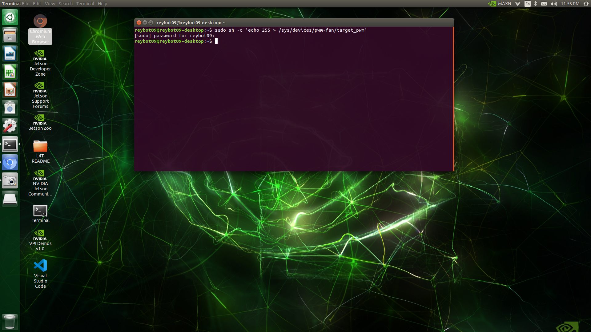

# Installing VSCode, Python and Java on a Jetson Nano and Configuring the Fan

## Installing VSCode and Python

1. First, log into your Jetson Nano device. Once logged in, you will need to connect to the internet before downloading anything from the internet. Choose a wifi connection by clicking on the wifi icon on the top right corner of the toolbar:


You will then be prompted to select the name of the wifi connection to connect to and enter the wifi connection's password:


2. Next, open a <i>Terminal Window</i> -- a special program used for issuing computer commands to your machine.  The commands issued will be commands that download programs (VSCode, Python and Java) from the internet. 

To open a Terminal window, simply double-click on the "Terminal" shortcut on the desktop:


This will open a purple "Terminal Window" with a cursor.  This will be where we will input our download commands:


3. Now, we will run 3 commands that will download and install VSCode and Python.
Copy the following command, and paste it into the Terminal window, and press "ENTER". (you can also type the command into the Terminal by hand, but this can be error-prone and the command needs to be typed in verbatim.). 
```bash
git clone https://github.com/JetsonHacksNano/installVSCode.git
```

After pressing "ENTER", the Terminal will output information explaining what action it performed. It will look as follows:


Now, copy and paste the second command.  Then, hit "ENTER".  This command (`cd`) "changes directories" into the 'installVSCode' directory.  In otherwords, you are opening the 'installVSCode' folder to access the files in it:
```bash
cd installVSCode
```

You will not see any output on the terminal, but the location on your Terminal window will change to 'installVSCode', because you are now inside of a folder called 'installVSCode':


Lastly, copy and paste the following command.  It simply runs a "shell script" file called 'installVSCodeWithPython.sh' that handles the installation of VSCode and Python for us.  (NOTE: When promted, enter your Jetson Nano's password.  You're asked for it because system files that require admin access will be updated). This command may take up to three minutes to finish executing:
```bash
sudo ./installVSCodeWithPython.sh
```


Once the Terminal screen stops outputting information, search for 'VSCode' in your computer:
 


Lastly, go back to the terminal and type the `clear` command to erase all of the output generated by the previous command: 
```bash
clear
```

Then, run the following command to verify that Python was installed:
```bash
python --version
```

Your terminal screen should output information on the version of python:


That's it! You've downloaded VSCode and Python onto your Jetson Nano.


# Installing Java

1). Open a Terminal window and run the following command to download Java. When prompted, enter your password.  You will also be asked if you would like to accept the installation location of the software -- press 'Y' and "ENTER" to continue:
```bash
sudo apt install default-jdk
```

Your output will look as follows:


2). Java should now be installed.  To verify, run the following command to show details about the version of Java that was installed:
```bash
java -version
```

The output should look similar to the following (simply showing details about the installation):


That's it -- you installed Java on your Jetson Nano!

# Configuring the Fan on the Jetson Nano
1). Open a Terminal window and run the following commands in order:

First (this command will prompt you for your password. Provide it when prompted):
```bash
sudo sh -c 'echo 255 > /sys/devices/pwm-fan/target_pwm'
```



Second: This will open up a new file on the Terminal.
```bash
sudo vi /etc/rc.local
```


Third: hit the letter `i` on your keyboard (this is needed to tell your Terminal that you are about to`i`nsert data into thie file you just opened. You will see the word "insert" on the bottom left corner of your Terminal to indicate that it is, in fact, in "insert" mode:


Then, copy and paste the following into the terminal:
```bash
#!/bin/bash
sleep 10
sudo /usr/bin/jetson_clocks
sudo sh -c 'echo 255 > sys/devices/pwm-fan/target_pwm'
```


Once pasted, simply press the escape key `esc` on your keyboard, then colon (`:`) an the letters `wq`. This signals the terminal to `w`rite and `q`uit (it's complicated, I know:( ). 

So:
- press `esc`, and the 'INSERT'word should disappear from the bottom left of your Terminal (this is good, it means you're out of insert mode):


- Now,type the colon key followed by lower-case `w` and lower-case `q` with no spaces in betweeen any of the three characters, like this:  `:wq`

- press the enter key, and the file should now close.


2). Now the file should be closed, and you'll be able to run commands again on your Terminal screen. Copy and paste the following commmand:
```bash
sudo chmod u+x /etc/rc.local
```


3).  Finally, reboot the Jetson Nano with the following command (You can skip this step. It's just suggested to refresh the system files since we just updated one -- making the changes take effect  when restarting. The changes will take effect after the Nano is rebooted.):
```bash
sudo reboot
```

All done.

